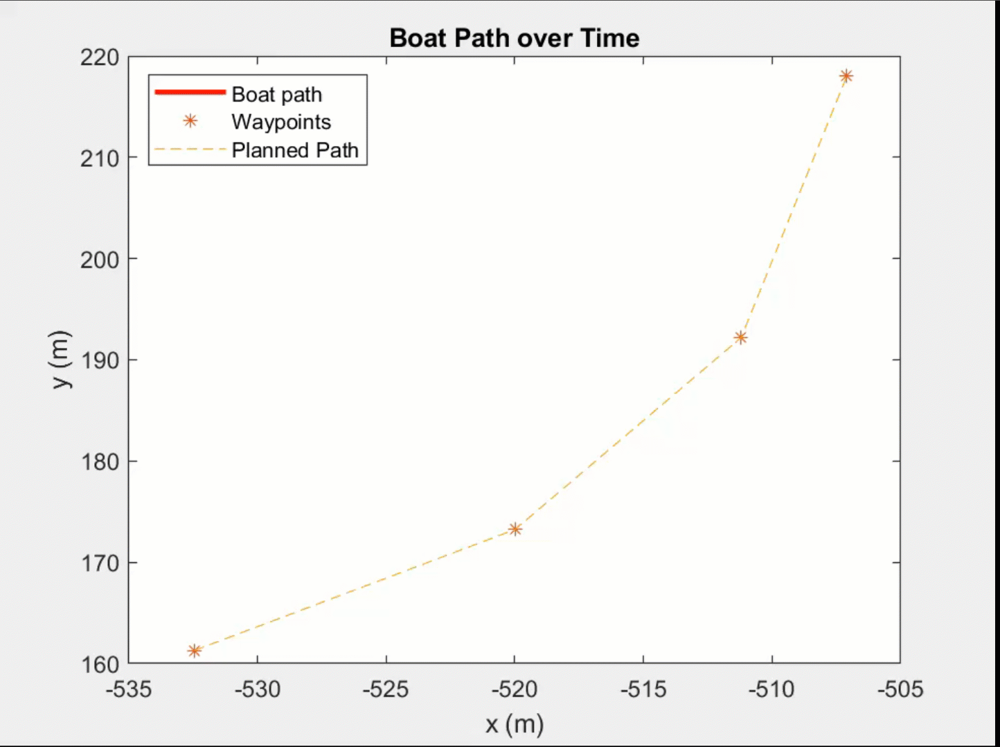
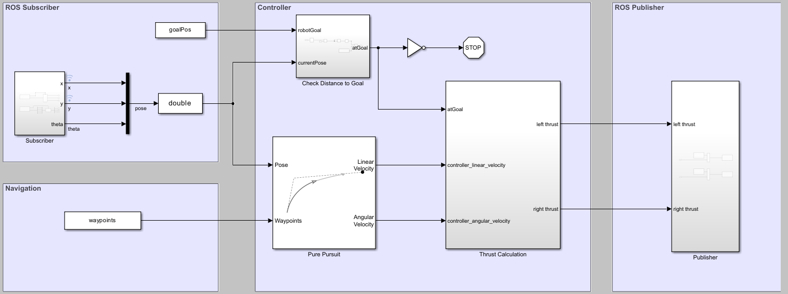

# Controller Design for Autonomous Boats

This repository contains the model associated with the blog "Controller Design for WAM-V" on MathWorks® Student Lounge. This also serves as a starter code for the MathWorks Simulation Award at RobotX 2024. The model uses MATLAB® 2024a and Simulink® for the controller design and interfaces with [VRX simulation](https://github.com/osrf/vrx) environment, developed by Open Source Robotics Foundation (OSRF) and the Naval Postgraduate School.

## Getting started

To get started,  install the VRX Simulator as described [in this tutorial](https://github.com/osrf/vrx/wiki/getting_started_tutorial) and clone this repository. Start the simulation and ensure the ROS topics published by the simulator is visible to MATLAB and then open the WAMV_control.prj which should open the model shown below. Run the Simulink model to publish the thrust commands to the simulator for follwoing the reference path/goal. More details can be found in the blog linked above.

The model requires the following products:
- [Simulink®](https://www.mathworks.com/products/simulink.html)
- [Aerospace Blockset™](https://www.mathworks.com/products/aerospace-blockset.html)
- [Mapping Toolbox™](https://www.mathworks.com/products/mapping.html)
- [Robotics System Toolbox™](https://www.mathworks.com/products/robotics.html)
- [ROS Toolbox](https://www.mathworks.com/products/ros.html)

For questions or clarifications on the model, please contact roboticsarena@mathworks.com

## License
The license is available in the [license.txt](license.txt) file in this GitHub repository.

## Community Support
[MATLAB Central](https://www.mathworks.com/matlabcentral/)

Copyright 2024 The MathWorks, Inc.
